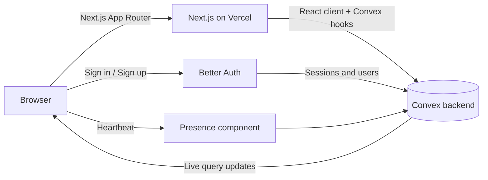

<div align="center">

# 📝 Blog Application

**A real-time, full-stack blogging platform built with Next.js 16, Convex and Better Auth.**

[](https://blog-application-tudp.vercel.app/)


[Live Demo](https://blog-application-tudp.vercel.app/) · [Report a Bug](https://github.com/arihantjain6/Blog-Application/issues) · [Request a Feature](https://github.com/arihantjain6/Blog-Application/issues)

</div>

---

## Table of Contents

1. [Overview](#overview)
2. [Features](#features)
3. [Tech Stack](#tech-stack)
4. [Architecture](#architecture)
5. [Project Structure](#project-structure)
6. [Getting Started](#getting-started)
7. [Environment Variables](#environment-variables)
8. [Available Scripts](#available-scripts)
9. [Authentication Flow](#authentication-flow)
10. [Real-Time Presence](#real-time-presence)
11. [Deployment](#deployment)
12. [Troubleshooting](#troubleshooting)
13. [Roadmap](#roadmap)
14. [Contributing](#contributing)
15. [Author](#author)

---

## Overview

Blog Application is a modern blogging platform where users can create an account, write and publish posts, and browse content from other authors. Instead of a traditional REST API and SQL database, it uses **Convex** as a reactive backend: data updates are pushed to every connected client automatically, so the UI stays in sync without manual refetching or polling.

The project is also a practical reference for wiring together the current Next.js App Router, React 19, Convex, Better Auth and Tailwind CSS 4 stack.

## Features

**Content**
- Create, read, update and delete blog posts
- Live feed that updates instantly when new posts are published
- Sample dataset (`sampleData.jsonl`) for quickly seeding a demo

**Authentication and users**
- Sign up and sign in with Better Auth through the `@convex-dev/better-auth` integration
- Session-aware navigation, with protected actions for signed-in users
- User avatars and a dropdown account menu

**Real-time experience**
- Presence indicators powered by `@convex-dev/presence`, showing who is currently online
- Toast notifications (Sonner) for success and error feedback

**UI and developer experience**
- Fully responsive layout
- Light and dark themes with `next-themes`
- Accessible components built on Radix UI and shadcn/ui
- Form validation with React Hook Form and Zod
- Strict TypeScript, ESLint and Prettier

## Tech Stack

| Category | Technology |
| --- | --- |
| Framework | Next.js 16 (App Router), React 19 |
| Language | TypeScript 5 |
| Backend and database | Convex (reactive database, server functions) |
| Authentication | Better Auth, `@convex-dev/better-auth` |
| Real-time | `@convex-dev/presence` |
| Styling | Tailwind CSS 4, `tw-animate-css`, `class-variance-authority`, `tailwind-merge` |
| UI components | shadcn/ui, Radix UI, lucide-react |
| Forms and validation | React Hook Form, Zod, Yup, `@hookform/resolvers` |
| Notifications | Sonner |
| Package manager | pnpm |
| Hosting | Vercel |

## Architecture



1. The Next.js app renders pages and server components.
2. Client components subscribe to Convex queries, and results update live.
3. Mutations run as typed server functions inside Convex.
4. Better Auth stores users and sessions in Convex.
5. The presence component tracks who is currently viewing the app.

## Project Structure

```
Blog-Application/
├── app/                        # App Router routes, layouts and pages
├── components/                 # Reusable UI (shadcn/ui primitives and custom components)
├── convex/                     # Convex schema, queries, mutations and auth configuration
├── lib/                        # Utilities and shared helpers
├── public/                     # Static assets
├── proxy.ts                    # Next.js 16 proxy (formerly middleware)
├── components.json             # shadcn/ui configuration
├── next.config.ts              # Next.js configuration
├── postcss.config.mjs          # Tailwind CSS 4 PostCSS plugin
├── eslint.config.mjs           # ESLint flat config
├── sampleData.jsonl            # Seed data
├── INTERVIEW_EXPLANATION.md    # Architecture and design walkthrough
└── REACT_COMPONENTS_EXPLAINED.md  # Component-by-component guide
```

## Getting Started

### Prerequisites

- **Node.js** 20 or newer
- **pnpm** (`npm install -g pnpm`), or npm / yarn / bun
- A free **[Convex](https://www.convex.dev/)** account

### 1. Clone and install

```bash
git clone https://github.com/arihantjain6/Blog-Application.git
cd Blog-Application
pnpm install
```

### 2. Start the Convex backend

```bash
npx convex dev
```

On first run this logs you in, creates a development deployment, and writes `CONVEX_DEPLOYMENT` and `NEXT_PUBLIC_CONVEX_URL` to `.env.local`. Leave it running.

### 3. Add the remaining environment variables

See [Environment Variables](#environment-variables).

### 4. Start the Next.js app

```bash
pnpm dev
```

Open **http://localhost:3000**.

### 5. (Optional) Seed sample data

```bash
npx convex import --table <your-table-name> sampleData.jsonl
```

## Environment Variables

Create `.env.local` in the project root.

| Variable | Where | Description |
| --- | --- | --- |
| `CONVEX_DEPLOYMENT` | `.env.local` | Written automatically by `npx convex dev` |
| `NEXT_PUBLIC_CONVEX_URL` | `.env.local` | Convex deployment URL used by the client |
| `NEXT_PUBLIC_CONVEX_SITE_URL` | `.env.local` | Convex HTTP actions URL, used by Better Auth |
| `SITE_URL` | Convex dashboard | Base URL of the app, e.g. `http://localhost:3000` |
| `BETTER_AUTH_SECRET` | Convex dashboard | Long random string used to sign sessions |

Set Convex-side variables with:

```bash
npx convex env set BETTER_AUTH_SECRET "$(openssl rand -base64 32)"
npx convex env set SITE_URL http://localhost:3000
```

> ⚠️ Never commit `.env.local`. Adjust variable names to match your `convex/` auth config.

## Available Scripts

| Command | Description |
| --- | --- |
| `pnpm dev` | Start the Next.js development server |
| `pnpm build` | Create an optimized production build |
| `pnpm start` | Serve the production build |
| `pnpm lint` | Run ESLint |
| `pnpm format` | Format source files with Prettier |
| `npx convex dev` | Run the Convex backend in watch mode |
| `npx convex deploy` | Deploy backend functions to production |

## Authentication Flow

1. A visitor opens the sign-up form. Inputs are validated client-side with React Hook Form and Zod.
2. The form calls Better Auth, which creates the user and a session in Convex.
3. The session cookie is set, and the UI switches to the signed-in state.
4. Protected pages and mutations check the session server-side before doing any work.
5. Signing out clears the session and returns the user to the public view.

## Real-Time Presence

`@convex-dev/presence` sends lightweight heartbeats from each open tab. Convex aggregates them into a reactive list of online users, so avatars appear and disappear the moment someone joins or leaves, with no custom WebSocket code.

## Deployment

**Backend**

```bash
npx convex deploy
```

**Frontend (Vercel)**

1. Push the repository to GitHub.
2. Import it at [vercel.com/new](https://vercel.com/new).
3. Add `NEXT_PUBLIC_CONVEX_URL` and `NEXT_PUBLIC_CONVEX_SITE_URL` (production values) as project environment variables.
4. Set `SITE_URL` and `BETTER_AUTH_SECRET` on your **production** Convex deployment.
5. Deploy.

## Troubleshooting

| Problem | Fix |
| --- | --- |
| Page loads but data never appears | Make sure `npx convex dev` is running and `NEXT_PUBLIC_CONVEX_URL` is set |
| Sign-in fails or redirects incorrectly | Check `SITE_URL` matches the URL you are browsing |
| "Invalid secret" or session errors | Set `BETTER_AUTH_SECRET` on the Convex deployment, not only locally |
| Styles look broken | Confirm `@tailwindcss/postcss` is installed and `postcss.config.mjs` exists |
| Production build fails | Check `build-log.txt` and run `pnpm lint` locally |

## Roadmap

- [ ] Rich-text / Markdown editor with live preview
- [ ] Comments and reactions
- [ ] Tags, categories and full-text search
- [ ] Image uploads for post covers
- [ ] Draft and scheduled publishing
- [ ] SEO metadata and RSS feed

## Contributing

1. Fork the repository
2. Create a branch: `git checkout -b feature/my-feature`
3. Commit your changes: `git commit -m "Add my feature"`
4. Push: `git push origin feature/my-feature`
5. Open a Pull Request

## Author

**Arihant Jain**, [@arihantjain6](https://github.com/arihantjain6)

If this project helped you, consider giving it a ⭐
